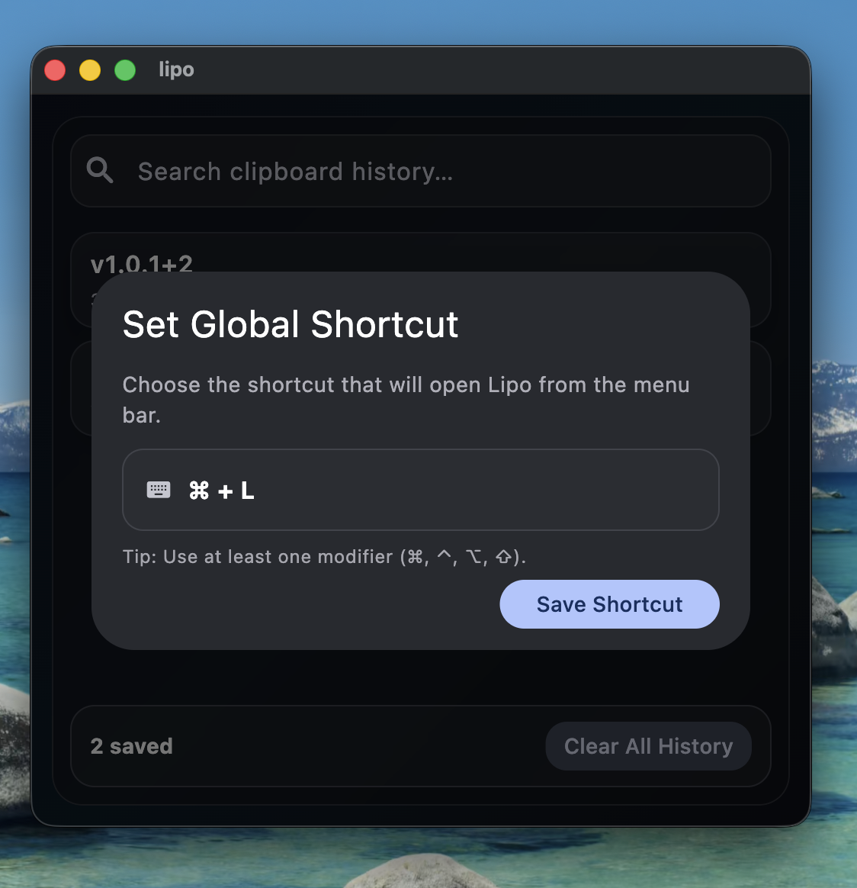
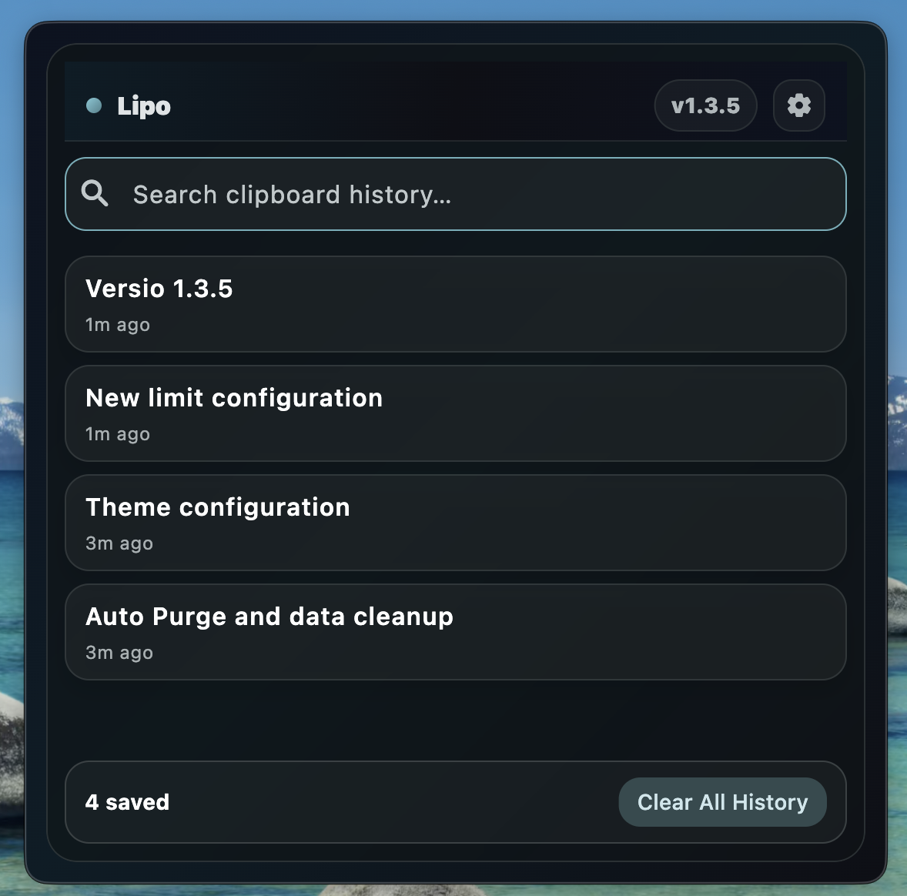
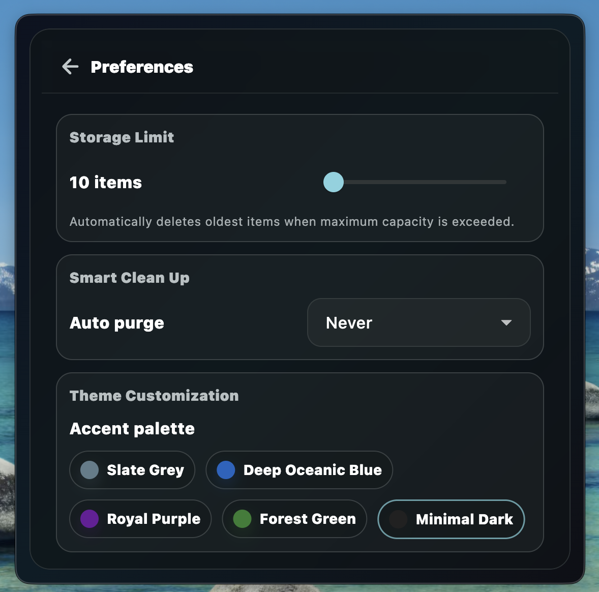

# Lipo (macOS Clipboard Manager)

A lightweight, modern, and highly-optimized clipboard manager for macOS built with Flutter. It runs seamlessly as a menu bar utility (tray icon + context menu), tracking history securely and storing records locally using an ultra-fast Isar NoSQL database instance.

## Showcase

Here is a quick look at the user experience, core dashboard layouts, and configuration options:

### 1. Set Shortcut Dialog

Configure your preferred global hotkey combination to summon the clipboard manager instantly from anywhere in macOS.



### 2. Main Application Interface

A sleek, focused view of your clipboard history complete with instant search, quick actions, and relative metadata.



### 3. Preferences & Personalization (New in v1.3.5)

Manage local capacity thresholds, schedule background database purges, and switch accent colors instantly within a compact, beautiful overlay frame.



> 💡 **System Tray Lifecycle:** After initial configuration, the main window will slide away, and the application will reside quietly in your **system tray (menu bar)**. You can summon it at any time using your designated shortcut or by clicking the menu bar icon.

---

## Features

- **Menu Bar (Tray) App Experience**
  - Left-click toggles the window instantly.
  - Right-click triggers a quick context menu (Open/Hide Preferences, Change Shortcut, Clear History, Quit).
- **True macOS Overlay Integration**
  - Built using a native `NSPanel` backing layer instead of a basic `NSWindow`.
  - Stays pinned at `.statusWindow` level to draw smoothly on top of full-screen IDEs, web browsers, and games.
  - Automatically reads cursor coordinates via `NSEvent.mouseLocation` to ensure the overlay displays on your active monitor screen.
- **Automatic Clipboard Capture**
  - Non-blocking platform polling channel loops every 1 second.
  - Intelligently ignores empty/whitespace-only items.
  - deduplicates matches: identical entries automatically pull the existing database record to the top of the history list with an updated timestamp.
- **Smart Database Ceiling & Pruning (New in v1.3.5)**
  - **Capacity Ceiling:** Enforces an absolute maximum clipboard history length (Default: 100 entries). Automatically purges the oldest database keys when the cap is reached.
  - **Scheduled Clean Up:** Automatically flags and sweeps historic records based on user-defined retention windows (Daily, Weekly, Monthly, or Never).
- **Dynamic Accent Color Palettes (New in v1.3.5)**
  - Instantly shift app style systems across multiple custom colorways (Slate Grey, Oceanic Blue, Royal Purple, Forest Green, and Minimal Dark) with immediate provider-driven theme updates.
- **512×512 Fixed Window Geometry**
  - High-performance `ClampingScrollPhysics` engine prevents layout jitter.
  - Fast, indexed search bar for text sorting.
  - Row-level hover states for copy and deletion management.
  - Automatic app launch integration upon macOS startup via native Login Items profiles.

---

## Project Structure

```text
lib/
  db/
    clipboard_item.dart
    database_service.dart
    settings_model.dart            # Storage capacity & retention schemas
  presentation/
    provider/
      clipboard_provider.dart      # Database operations, limits & theme state
    ui/
      app.dart
      dashboard_page.dart
      settings_page.dart           # Preferences UI (Limits, Schedules, Themes)
  main.dart                        # Initialization & boot configurations
```
